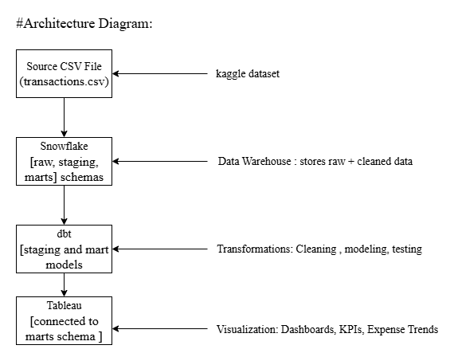

## Architecture Diagram

This project follows a modular, scalable architecture with clearly separated layers:

### Components:

-Data Source – A synthetic CSV file (transactions_raw.csv) simulates real-world bank transactions including date, description, category, amount, and type.

-Data Warehouse (Snowflake) 
    Central data platform hosting:
        -Raw data as-is (raw.transactions_raw)
        -Cleaned and standardized staging models
        -Final analytical marts used for dashboards

-Transformation Engine (dbt) 
    Applied within Snowflake to:
    -Clean and validate raw data
    -Perform complex aggregations and calculations
    -Apply schema tests for data integrity

-Business Intelligence Tool (Tableau) 
    Used for:
        -Connecting to Snowflake marts schema
        -Visualizing income vs expense trends, forecasting, and KPIs
        -Providing interactive dashboards

---