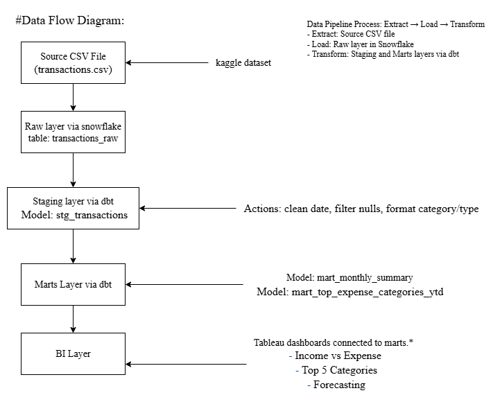

## ELT Process: Raw → Staging → Marts → BI

This project follows a structured ELT (Extract → Load → Transform) pipeline using Snowflake and dbt:

### 1. Raw Layer

-Extract + Load (no transformation yet)
-Source: Uploaded synthetic CSV (transactions_raw.csv)
-Table: raw.transactions_raw

Contents: As-is data from the source with all records (including nulls,invalids)

✅ Purpose: Preserve original source data for audit or rollback
🧾 Columns: date, transaction_description, category, amount, type

### 2. Staging Layer

-Initial cleaning, parsing, and standardization
-Model: stg_transactions in staging schema
-Built with dbt, includes:
    -Date parsing
    -Category/type standardization
    -Amount rounding
    -Null/negative value filtering

Tests: not_null, unique, accepted_values, custom_positive_amount

✅ Purpose: Create clean, analysis-ready records
🧾 Output Columns: transaction_id, transaction_date, description, category, transaction_amount, type

### 3. Marts Layer

-Business logic, aggregations, KPIs
-Final dbt models to build facts, trends, summaries:
    -mart_monthly_summary → income, expenses, net savings by month
    -mart_top_expense_categories_ytd → Top 5 YTD spending categories
    -mart_category_summary → Category-wise income vs expense
    -mart_top5_months_income → Highest-earning months

✅ Purpose: Serve business-friendly metrics to BI tools
🧾 Aggregated metrics used directly in Tableau

### 4. BI Layer (Tableau)
-Final dashboards for business stakeholders
-Tableau connects directly to Snowflake marts schema
-Dashboards built on top of mart_* tables
-Visuals:

    -Monthly Summary
    -Forecasting
    -Category Heatmap
    -Top Expenses Bar Chart
    -Savings % Trend

✅ Purpose: Provide interactive insights and trends
